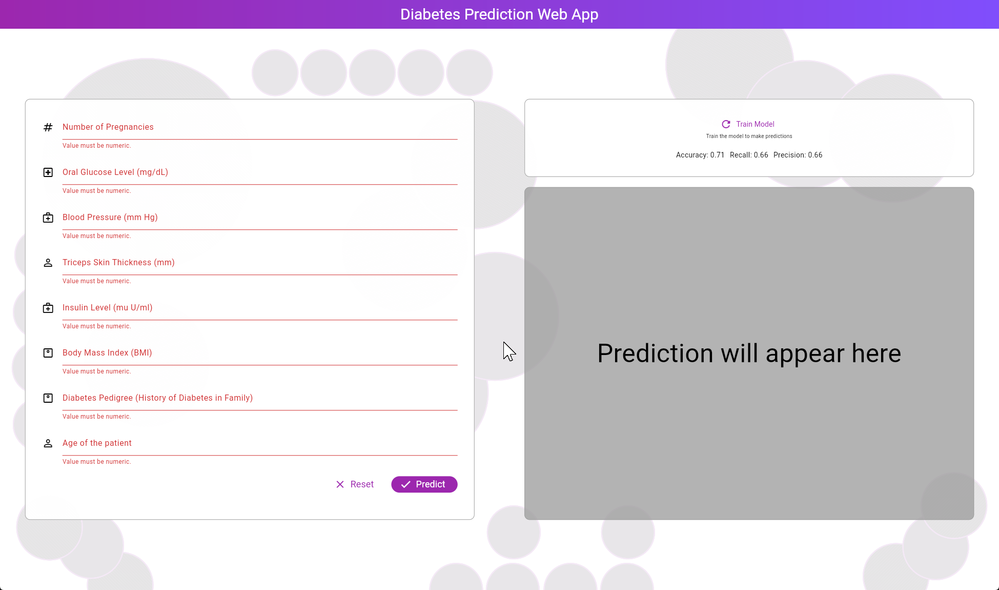
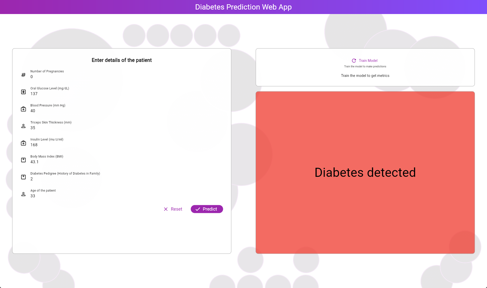
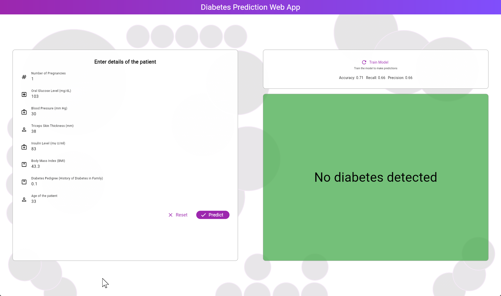

# Diabetes Classifier App

A diabetes classification app using Flutter and Dart.

## Screenshots

### Validation

### Prediction

### Prediction

## Project Details

### Languages Used
- **C++**: 38.6%
- **Dart**: 36%
- **CMake**: 21.3%
- **HTML**: 2.6%
- **C**: 1.5%

### Features
- Validates diabetes data
- Predicts diabetes based on input data

### Setup and Installation
1. Clone the repository: `git clone https://github.com/zaid-kamil/diabetes_classifier_app`.
2. Follow the Flutter setup instructions [here](https://flutter.dev/docs/get-started/install).
3. Run the app using `flutter run`.

### Contribution
Feel free to contribute to this project by submitting issues or pull requests.

For more details, visit the repository [here](https://github.com/zaid-kamil/diabetes_classifier_app).
